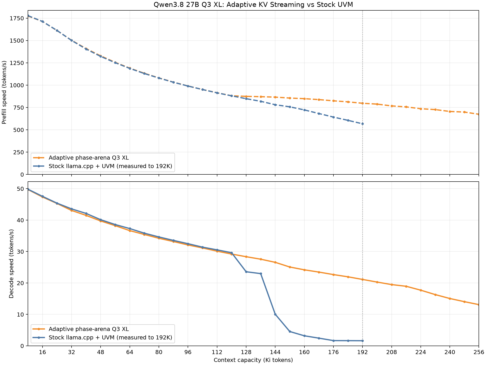
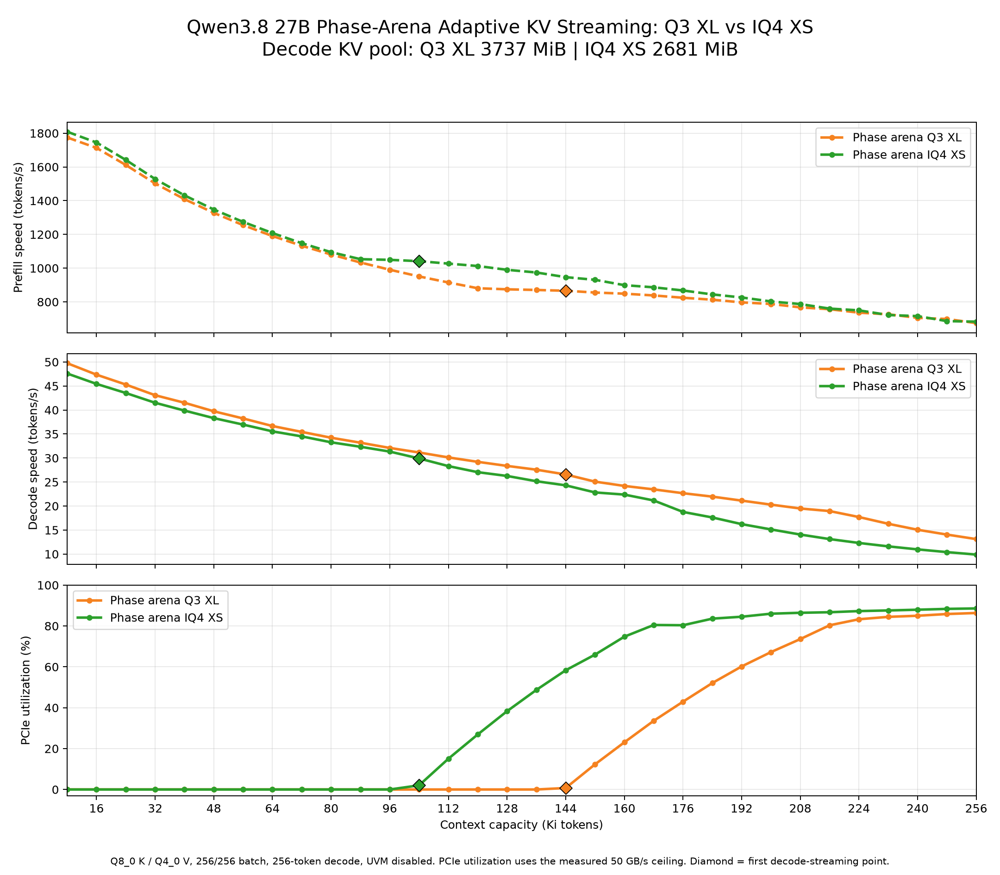

# Adaptive KV Streaming for llama.cpp

This branch adds experimental, block-granular adaptive KV cache streaming to the CUDA `llama-server`. It is intended for running long contexts when model weights leave too little VRAM for the complete KV cache, without relying on uncontrolled Unified Memory page migration.

## Adaptive KV streaming

The authoritative KV tensors remain in pinned host memory while a bounded CUDA pool is divided between resident KV pages and one transfer ring shared by all streamed attention layers. As the active context grows, the runtime keeps as many pages resident as the budget allows and gradually reclaims resident space for a larger ring. Nonresident pages are prefetched for later layers while the current layer computes, and consumed ring slots are recycled immediately. Every attention layer still processes its complete KV history; only physical residency and transfer scheduling change.

## Phase arena

`--kv-stream-arena-mib N` extends that adaptive pool into one fixed physical CUDA allocation shared by KV storage, the transfer ring, and phase-specific compute buffers. Prompt processing and token generation do not need their peak compute workspaces simultaneously. During prefill, the scheduler borrows the larger prompt-processing workspace while KV retains a small nonzero ring. When ordinary TG1 decode begins, the prefill CUDA graph and scheduler workspace are released, and those bytes become additional resident/ring KV capacity.

This phase multiplexing prevents context-specific compute reservations from permanently reducing the memory available to decode. As a result, the usable decode KV pool remains nearly constant across different `--ctx-size` settings. Inside that stable total budget, adaptive KV streaming still changes the resident/ring partition in real time according to active context length and measured prefetch behavior.

Detailed project story, design, implementation, and benchmark results are in
[Running Qwen 27B on 16G VRAM with Full Context Length: Building Adaptive KV Cache Streaming for llama.cpp](https://medium.com/@raymond860909/running-qwen-27b-on-16g-vram-with-full-context-length-building-adaptive-kv-cache-streaming-for-bf1e819116e9).

## Performance

The first comparison uses Qwen3.8 27B `UD-Q3_K_XL` with a Q8_0 K cache and Q4_0 V cache on an RTX 5070 Ti 16 GB. Adaptive KV streaming keeps explicit control of residency and transfer scheduling, while the phase arena preserves its decode KV budget as the configured context grows. The implementation continues through the model's 256K native context; the stock Unified Memory run was measured through 192K.



The second comparison isolates the phase-arena implementation and shows how target-model quantization changes the available KV budget. `UD-Q3_K_XL` leaves more VRAM for resident KV and begins streaming later than the larger `UD-IQ4_XS` model. All three panels share the same context-capacity axis. The subtitle reports the decode KV pool: 3737 MiB for Q3 XL and 2681 MiB for IQ4 XS. PCIe utilization estimates effective decode KV H2D traffic against the measured 50 GB/s transfer ceiling, and diamonds mark the first decode-streaming point.



Both phase-arena sweeps use 256-token batch and micro-batch sizes, a 256-token decode, Q8_0 K/Q4_0 V, one server slot, and no Unified Memory. The benchmark driver selected the largest validated arena for each configured context capacity.

> [!WARNING]
> This is research code optimized and production-validated primarily for an RTX 5070 Ti with 16 GB VRAM, `unsloth/Qwen3.8-27B-GGUF` `UD-Q3_K_XL`, a 262144-token context, Flash Attention, a Q8_0 K cache, a Q4_0 V cache, and one server slot.
> CUDA correctness tests cover every KV type currently accepted by the CLI, including native and F16-conversion fallback paths. Production performance for other models, KV combinations, parallel slots, and non-CUDA backends is not yet broadly characterized.

## Build the modified server

Install a C++ compiler, CMake, and the CUDA toolkit, then run this command from the repository root:

```bash
cmake -S . -B build -DGGML_CUDA=ON -DGGML_CUDA_FA_ALL_QUANTS=ON -DCMAKE_BUILD_TYPE=Release && cmake --build build --config Release --target llama-server -j
```

The executable is created at `build/bin/llama-server`.

Example using the tested cache configuration:

```bash
./build/bin/llama-server \
  --model /path/to/model.gguf \
  --ctx-size 262144 \
  -fa on \
  -ctk q8_0 \
  -ctv q4_0 \
  -ngl all \
  -b 512 \
  -ub 512 \
  -np 1 \
  --kv-stream-arena-mib 2304
```

The arena value is the fixed total shared allocation, not just KV capacity. Its bytes are reassigned between the active phase's CUDA compute workspace and the adaptive resident/ring KV pool. The best value depends on the model, batch sizes, GPU, and other VRAM consumers. Once selected, the same arena can preserve nearly the same decode KV capacity across different context settings. The benchmark driver below probes the maximum usable value automatically. `--kv-stream-stage-mib` remains a compatibility alias with the same total-arena semantics.

llama.cpp's device-memory auto-fit dry run is bypassed when a nonzero arena is configured. The arena and supported single-GPU layer placement are already explicit, while the upstream no-allocation estimator cannot represent overlapping phase lifetimes. Real context initialization still measures both phase graphs and rejects an arena that cannot fit either layout.

### Batch and micro-batch sizes

`-b` sets the logical prompt batch size and `-ub` sets the largest physical batch submitted to one graph. This branch no longer requires `256/256`; `-ub` may be any positive value no larger than `-b`.

The Qwen3.8 MMA prefill path processes the full physical batch and allocates only the partial workspace that kernel actually emits. Generic vector and F16-conversion fallback paths use a bounded 256-query workspace: each staged KV span is consumed by all query tiles before its ring slot is released, so wider micro-batches do not multiply KV host-to-device transfers.

The Q8_0/Q4_0 Qwen configuration has been exercised with `b/ub` values `256/256`, `512/512`, `768/512`, and `1024/1024`, including non-divisible final micro-batches. A 122880-token production-shaped run at `512/512` completed with adaptive streaming active. Wider values can require more graph and accumulator memory, so validate them on the target GPU.

### Optional Unified Memory for model weights

Adaptive KV streaming works with or without Unified Memory. Leave `GGML_CUDA_ENABLE_UNIFIED_MEMORY` unset for ordinary CUDA device allocations. To make GPU-offloaded model buffers CUDA managed allocations, launch the same server with the environment variable enabled:

```bash
GGML_CUDA_ENABLE_UNIFIED_MEMORY=1 \
./build/bin/llama-server \
  --model /path/to/model.gguf \
  --ctx-size 262144 \
  -fa on \
  -ctk q8_0 \
  -ctv q4_0 \
  -ngl all \
  -b 512 \
  -ub 512 \
  -np 1 \
  --kv-stream-arena-mib 2304
```

With this flag, CUDA-backed model buffers, including GPU-offloaded weights, are allocated with `cudaMallocManaged` and their pages can migrate between VRAM and host memory. The shared phase arena is intentionally different: it is still allocated with `cudaMalloc`, so its compute, resident-page, and transfer-ring slices remain physically allocated in VRAM. UVM is therefore optional for this branch and does not change the shared arena into pageable storage.

## Recreate the benchmark graph

The benchmark driver automatically selects the largest practical shared arena for each configured context capacity, sweeps from 8K through the requested maximum, and generates the CSV, PNG, and SVG results:

```bash
python3 -m pip install matplotlib

python3 benchmarks/benchmark_kv_stream.py \
  --model /path/to/model.gguf \
  --max-context 192K \
  --batch-size 512 \
  --ubatch-size 512
```

The only required arguments are the model GGUF and maximum context. See [benchmarks/README.md](benchmarks/README.md) for the arena-probing algorithm, generated files, optional settings, and resumable output directories.

---

## Upstream llama.cpp README

# llama.cpp


<div align="center">

<b>LLM inference in C/C++</b>

[](https://opensource.org/licenses/MIT)
[](https://github.com/ggml-org/llama.cpp/releases?q=tag:v0)
[](https://github.com/ggml-org/llama.cpp/releases?q=b)
[](https://github.com/ggml-org/llama.cpp/actions/workflows/server.yml)
[](https://github.com/ggml-org/llama.cpp/actions/workflows/docker.yml)
[](https://github.com/ggml-org/llama.cpp/actions/workflows/winget.yml)

[ggml](https://github.com/ggml-org/ggml) / [ops](https://github.com/ggml-org/llama.cpp/blob/master/docs/ops.md) / [maintainer PRs](https://github.com/ggml-org/llama.cpp/issues?q=is%3Apr%20is%3Aopen%20draft%3AFalse%20(author%3Argerganov%20OR%20author%3AKitaitiMakoto%20OR%20author%3Adanbev%20OR%20author%3Aaldehir%20OR%20author%3Amax-krasnyansky%20OR%20author%3ACISC%20OR%20author%3Aggerganov%20OR%20author%3Aam17an%20OR%20author%3Ajhen0409%20OR%20author%3Abartowski1182%20OR%20author%3Anikwen%20OR%20author%3Ahipudding%20OR%20author%3Aravi9%20OR%20author%3AServeurpersoCom%20OR%20author%3Apwilkin%20OR%20author%3Areeselevine%20OR%20author%3Angxson%20OR%20author%3Ajeffbolznv%20OR%20author%3Amarty1885%20OR%20author%3A0cc4m%20OR%20author%3ATitaniumtown%20OR%20author%3Aangt%20OR%20author%3AIMbackK%20OR%20author%3Aarthw%20OR%20author%3AJohannesGaessler%20OR%20author%3AORippler%20OR%20author%3Aruixiang63%20OR%20author%3Axctan%20OR%20author%3Aallozaur%20OR%20author%3Ayomaytk%20OR%20author%3Aaendk%20OR%20author%3Awine99%20OR%20author%3Agaugarg-nv%20OR%20author%3Ataronaeo%20OR%20author%3Aforforever73%20OR%20author%3Alhez%20OR%20author%3Anetrunnereve%20OR%20author%3Afairydreaming)%20sort%3Aupdated-desc) / [dev stats](https://github.com/ggml-org/llama.cpp-dev) / [lib llama API](https://github.com/ggml-org/llama.cpp/issues/9289) / [llama-server REST API](https://github.com/ggml-org/llama.cpp/issues/9291)

</div>

## Quick start

A few options to get `llama.cpp` installed on your machine:

- Visit https://llama.app and follow the instructions
- Run with Docker - see our [Docker documentation](docs/docker.md)
- Download pre-built binaries from the [releases page](https://github.com/ggml-org/llama.cpp/releases)
- Build from source by cloning this repository - check out [our build guide](docs/build.md)

Once installed:

```sh
# Download and run a model directly from Hugging Face
llama cli -hf ggml-org/Qwen3.5-0.8B-GGUF

# Launch OpenAI-compatible API server
llama serve -hf ggml-org/Qwen3.5-0.8B-GGUF
```

<table align="center">
    <tr>
        <td align="center" width=50%>
            
            <i>VLM session with <b>llama cli</b></i>
        </td>
        <td align="center">
            
            <i>Built-in web UI against <b>llama serve</b></i>
        </td>
    </tr>
<table>

## Description

The main goal of `llama.cpp` is to enable LLM (and VLM) inference with minimal setup and state-of-the-art performance on
a wide range of hardware - locally and in the cloud.

- Plain C/C++ implementation without any dependencies
- Apple silicon is a first-class citizen - optimized via ARM NEON, Accelerate and Metal frameworks
- AVX, AVX2, AVX512 and AMX support for x86 architectures
- RVV, ZVFH, ZFH, ZICBOP and ZIHINTPAUSE support for RISC-V architectures
- 1.5-bit, 2-bit, 3-bit, 4-bit, 5-bit, 6-bit, and 8-bit integer quantization for faster inference and reduced memory use
- Custom CUDA kernels for running LLMs on NVIDIA GPUs (support for AMD GPUs via HIP and Moore Threads GPUs via MUSA)
- Vulkan and SYCL backend support
- CPU+GPU hybrid inference to partially accelerate models larger than the total VRAM capacity

The `llama.cpp` project is build on top of the [ggml](https://github.com/ggml-org/ggml) library.

## Supported backends

| Backend | Target devices |
| --- | --- |
| [BLAS](docs/build.md#blas-build) | All |
| [BLIS](docs/backend/BLIS.md) | All |
| [CANN](docs/build.md#cann) | Ascend NPU |
| [CUDA](docs/build.md#cuda) | Nvidia GPU |
| [HIP](docs/build.md#hip) | AMD GPU |
| [Hexagon](docs/backend/snapdragon/README.md) | Snapdragon |
| [IBM zDNN](docs/backend/zDNN.md) | IBM Z & LinuxONE |
| [MUSA](docs/build.md#musa) | Moore Threads GPU |
| [Metal](docs/build.md#metal-build) | Apple Silicon |
| [OpenCL](docs/backend/OPENCL.md) | Adreno GPU |
| [OpenVINO [In Progress]](docs/backend/OPENVINO.md) | Intel CPUs, GPUs, and NPUs |
| [RPC](https://github.com/ggml-org/llama.cpp/tree/master/tools/rpc) | All |
| [SYCL](docs/backend/SYCL.md) | Intel GPU |
| [VirtGPU](docs/backend/VirtGPU.md) | VirtGPU APIR |
| [Vulkan](docs/build.md#vulkan) | GPU |
| [WebGPU](docs/build.md#webgpu) | All |
| [ZenDNN](docs/build.md#zendnn) | AMD CPU |

## Documentation

#### Tools

- [cli](tools/cli/README.md)
- [completion](tools/completion/README.md)
- [server](tools/server/README.md)
- [GBNF grammars](grammars/README.md)

#### Development

- [How to build](docs/build.md)
- [Running on Docker](docs/docker.md)
- [Build on Android](docs/android.md)
- [Multi-GPU usage](docs/multi-gpu.md)
- [Performance troubleshooting](docs/development/token_generation_performance_tips.md)
- [GGML tips & tricks](https://github.com/ggml-org/llama.cpp/wiki/GGML-Tips-&-Tricks)
- [XCFramework](docs/xcframework.md)
- [Completions](docs/completions.md)
- [Models](docs/models.md)
- [Release process](docs/release.md)

## Contributing

- Contributors can open PRs
- Collaborators will be invited based on contributions
- Maintainers can push to branches in the `llama.cpp` repo and merge PRs into the `master` branch
- Any help with managing issues, PRs and projects is very appreciated!
- Read the [CONTRIBUTING.md](CONTRIBUTING.md) for more information

## Acknowledgements

- [yhirose/cpp-httplib](https://github.com/yhirose/cpp-httplib) - Single-header HTTP server, used by `llama-server` - MIT license
- [nothings/stb](https://github.com/nothings/stb) - Single-header image format decoder, used by multimodal subsystem - Public domain
- [nlohmann/json](https://github.com/nlohmann/json) - Single-header JSON library, used by various tools/examples - MIT License
- [mackron/miniaudio](https://github.com/mackron/miniaudio) - Single-header audio format decoder, used by multimodal subsystem - Public domain
- [sheredom/subprocess.h](https://github.com/sheredom/subprocess.h) - Single-header process launching solution for C and C++ - Public domain
